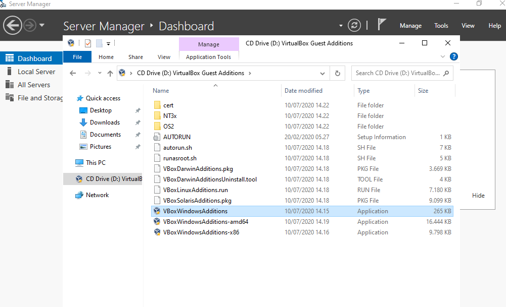
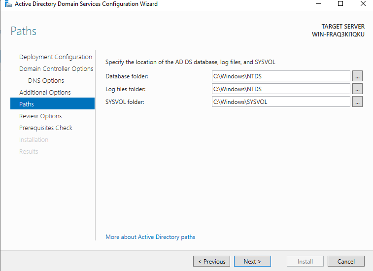

1202190021_ALIFIA KHAIRUNNISA_IT 02-02

 ### Ujian Tengan Semester Sistem Administrasi Server 
Download ISO Installer Windows Server 2022
      Kwmudian klik link : 
    https://www.microsoft.com/en-us/evalcenter/evaluate-windows-server-2022
    ```

     

        
    Atur memory dengan size 2048 MB kemudian next 
![A1]SAS/p2.jpg)

    Buat virtual machine pada hard disk kemudian next 


    Buat  Hard disk file type kemudian next


    Selanjutnya buat stroge on physical hard disk dan next saja 


    Buat File Location and size kemudian next 


    Masuk ke > Setting > Network dan ubah Nat menjandi Bridge Adapter lalu ok 


    Klik Start kemudia masukan file yang sudah di download tadi 


    Kemudian klik next dan install now


    Pilih Windows Server 2022 Standart (desktop) dan next


    Centang dan next kemudian 
    Pilih custome : install Microsoft Server Operating System Only (advanced)


    Klik next dan tunggu proses installasi hingga selesai 


    Setelah proses installasi selesai maka sistem akan reboot ke cpmplate proses


    Enter dan buat password baru pada customize setting 


    Setelah selesai buat password, akses menu input > keyboard > Insert Ctrl + Alt + Del , kemudian enter masukkan password yang sudah dibuat 


    Kemudian kembali ke menu Device > Insert Guest Additions Cd Image >  cd Drive Virtual box > pilih VBox WindiwsAdditions


    Lalu klik install 



    Reboot machine dan akses menu input – keyboard – Insert Ctrl + Alt + Del , kemudian enter masukkan password kembali 


    Jalankan winver untuk memvalidasi mesin 


    Windows Server 2022 terinstall 


###  INSTALLASI ACTIVE DIRECTORY DOMAIN SERVER 

    Ubah nama di windows powershell  dengan ketik > “rename -computer -Newname Server 2022” 


    Kemudian masuk pada server manager pilih menu Manage > Add roles features dan next 


    Kemudian pilih Role-Based  or feature-based installation dan next 


    Pilih select a server from the server pool , setelah itu pilih active directory domain server 


    Setelah itu klik add features 


    Masuk pada features kemudian centang Group Policy Management dan next 


    Kemudian masuk pada confirm installation selection dan install 





    Maaf pak masih ada yag error